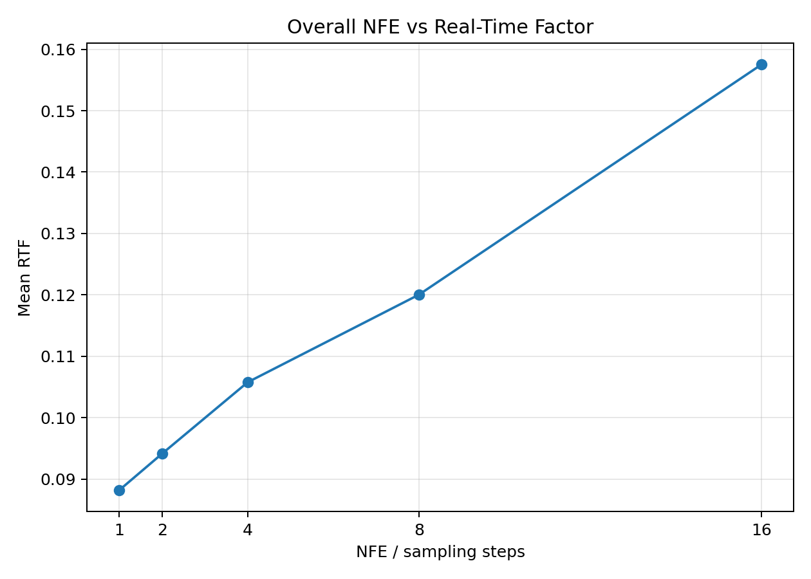
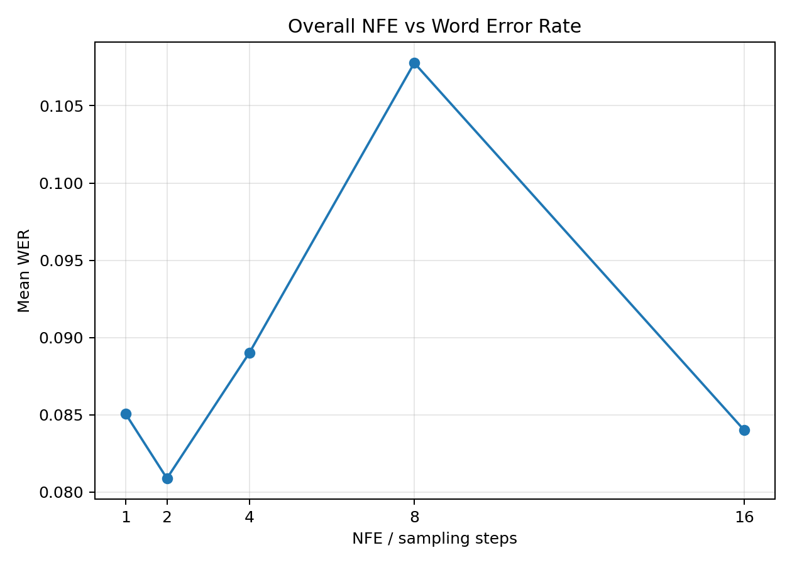
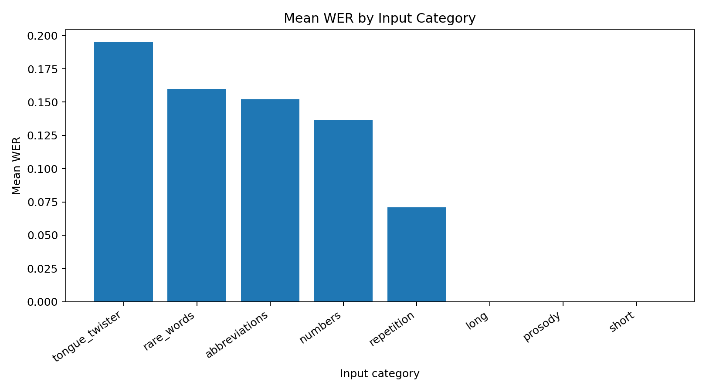
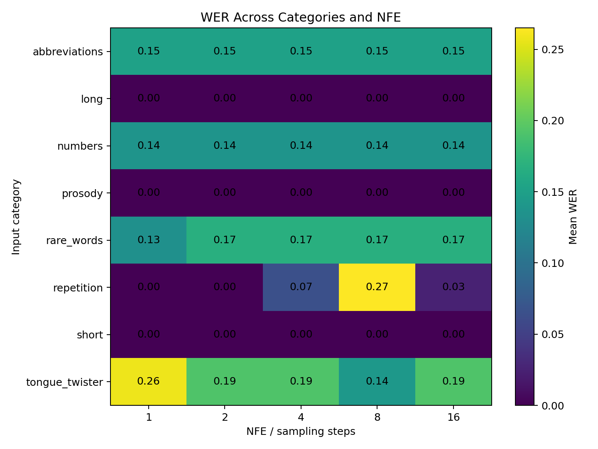

# RapFlow-TTS Few-Step Robustness Analysis

> A small-scale robustness study of few-step inference in **RapFlow-TTS**, focusing on speed, intelligibility, stress-test inputs, and the gap between ASR-based evaluation and human listening.

## Background

This project builds on **RapFlow-TTS: Rapid and High-Fidelity Text-to-Speech with Improved Consistency Flow Matching** (Interspeech 2025), co-authored by Hyun Joon Park, Jeongmin Liu, Jin Sob Kim, Jeong Yeol Yang, Sung Won Han, and Eunwoo Song.

- Paper: https://www.isca-archive.org/interspeech_2025/park25b_interspeech.html
- Official implementation: https://github.com/naver-ai/RapFlow-TTS

RapFlow-TTS is designed to synthesize high-quality speech with fewer generation steps. Rather than re-testing only the paper's average performance, this project asks:

> **Does few-step TTS remain stable across different input conditions, including difficult or unusual sentences?**

This is an independent analysis project using the official pretrained RapFlow-TTS model.

---

## Key Findings

Across a 40-sentence stress test with 5 sampling-step settings (`1, 2, 4, 8, 16`):

- **Lower NFE was faster**, as expected.
- Increasing NFE did **not** consistently reduce Whisper-based WER.
- Difficult categories included **tongue twisters, rare words, abbreviations, and numbers**.
- Some samples showed large ASR-WER changes across NFE settings.
- However, a blind listening review found that those ASR differences were **not always audible as actual content errors**.
- This suggests that **ASR-based WER alone is not sufficient for evaluating perceptual robustness in TTS**.

### Overall NFE results

| NFE | Mean WER | Mean RTF |
|---:|---:|---:|
| 1 | 0.0851 | 0.0882 |
| 2 | 0.0809 | 0.0941 |
| 4 | 0.0890 | 0.1058 |
| 8 | 0.1078 | 0.1200 |
| 16 | 0.0840 | 0.1575 |

---

## Main Figures

### 1. Speed vs sampling steps



### 2. Intelligibility vs sampling steps



### 3. Input-category difficulty



### 4. Category × NFE robustness




---

## Research Questions

1. How does the number of sampling steps affect inference speed?
2. Does intelligibility improve consistently as sampling steps increase?
3. Are some input types more sensitive to few-step inference than others?
4. Do ASR-based metrics such as WER agree with human listening judgments?

---

## Experimental Setup

### Model

- **RapFlow-TTS**
- Official pretrained **LJSpeech** checkpoint
- **HiFi-GAN** vocoder
- English single-speaker synthesis

### Sampling settings

```text
NFE / sampling steps = 1, 2, 4, 8, 16
```

### Baseline experiment

Three ordinary English sentences were synthesized at each NFE setting to verify the basic speed-quality behavior.

### Stress-test experiment

A 40-sentence set was created across 8 categories:

| Category | Purpose |
|---|---|
| short | simple, short utterances |
| long | multi-clause long sentences |
| numbers | years, decimals, times, percentages |
| abbreviations | NASA, GPU, CPU, TTS, ASR, etc. |
| rare_words | uncommon / technical vocabulary |
| repetition | repeated tokens or phrases |
| prosody | questions, exclamations, punctuation |
| tongue_twister | dense or difficult phonetic patterns |

Each sentence was synthesized at 5 NFE settings:

```text
40 sentences × 5 NFE settings = 200 audio samples
```

The input set is available in:

```text
data/stress_test_sentences.csv
```

---

## Evaluation

### Speed

I measured:

- model inference time
- total synthesis time
- Real-Time Factor (RTF)

```text
RTF = synthesis time / generated audio duration
```

Lower RTF means faster-than-real-time synthesis.

### Automatic intelligibility

Generated audio was transcribed with Whisper and compared against the input text using **Word Error Rate (WER)**.

Lower WER indicates better transcription agreement.

### Acoustic descriptors

The baseline experiment also examined:

- F0
- RMS energy
- voiced ratio
- spectral centroid

These were used as descriptive acoustic features, not as direct perceptual-quality scores.

### Blind listening

The most NFE-sensitive cases identified by Whisper WER were re-evaluated with a blind listening test.

The listener scored:

- word-content preservation
- pronunciation
- naturalness
- obvious audible errors

---

## Stress-Test Results

The most difficult categories by average Whisper WER included:

- tongue twisters
- rare words
- abbreviations
- numbers

The **long-sentence** category achieved an average WER of 0 in this experiment.

An important observation was that some categories, such as abbreviations, showed similar error rates across NFE settings. This suggests that not every transcription error is caused by insufficient sampling steps.

---

## Case Studies

Several utterances showed relatively large Whisper-WER variation across NFE settings:

```text
Go go go go go.

She sells seashells by the seashore.

Red lorry, yellow lorry, red lorry, yellow lorry.

The mathematician discussed eigenvectors and diffeomorphisms.

The test was hard, hard, hard, but fair.
```

For example, `She sells seashells by the seashore.` had a higher WER at NFE 1 while higher-NFE versions were transcribed correctly.

However, this raised an important question:

> Was the TTS output actually worse, or did Whisper simply recognize it differently?

---

## Blind Listening Validation

The five most NFE-sensitive cases were evaluated without revealing the NFE condition.

| NFE | Word Content | Pronunciation | Naturalness |
|---:|---:|---:|---:|
| 1 | 5.0 | 2.8 | 2.8 |
| 2 | 5.0 | 2.6 | 2.6 |
| 4 | 5.0 | 2.6 | 2.6 |
| 8 | 5.0 | 2.6 | 2.6 |
| 16 | 5.0 | 2.6 | 2.6 |

The intended word content was preserved across all evaluated NFE settings.

Therefore, large differences in Whisper WER were **not consistently reproduced as audible content errors**.

This is one of the main takeaways of the project:

> **ASR-based WER can be useful for screening TTS outputs, but it may not perfectly reflect human-perceived robustness.**

---

## Reproducibility

### Important note

This repository contains the **experiment and analysis scripts**, but it does not redistribute the RapFlow-TTS model code, pretrained checkpoints, or HiFi-GAN weights.

The scripts are intended to be run **inside a working clone of the official RapFlow-TTS repository**.

### 1. Clone the official implementation

```bash
git clone https://github.com/naver-ai/RapFlow-TTS.git
cd RapFlow-TTS
```

### 2. Set up RapFlow-TTS

Follow the official repository instructions to install dependencies and download:

- RapFlow-TTS checkpoint
- HiFi-GAN weights
- eSpeak / phonemizer dependencies

The environment used for this project was based on:

```text
Python 3.9
Conda environment: rapflow
```

### 3. Copy this project's files

Place:

```text
scripts/
data/
```

inside the RapFlow-TTS working directory.

### 4. Run the experiment pipeline

Example order:

```bash
python scripts/01_speed_benchmark.py
python scripts/02_quality_eval.py
python scripts/03_visualize_baseline.py
python scripts/04_make_blind_test.py
python scripts/05_generate_stress_test.py --sentences_csv data/stress_test_sentences.csv
python scripts/06_analyze_stress_test.py
python scripts/07_visualize_results.py
python scripts/08_make_blind_case_review.py
```

Some paths in the scripts may need to be adjusted depending on where checkpoints and generated outputs are stored.

---

## Repository Structure

```text
rapflow-tts-robustness-analysis/
├─ README.md
├─ requirements.txt
├─ .gitignore
│
├─ data/
│  └─ stress_test_sentences.csv
│
├─ scripts/
│  ├─ 01_speed_benchmark.py
│  ├─ 02_quality_eval.py
│  ├─ 03_visualize_baseline.py
│  ├─ 04_make_blind_test.py
│  ├─ 05_generate_stress_test.py
│  ├─ 06_analyze_stress_test.py
│  ├─ 07_visualize_results.py
│  └─ 08_make_blind_case_review.py
│
├─ results/
│  ├─ figures/
│  └─ tables/
│
└─ samples/
```

---

## Limitations

This is a small-scale undergraduate research project, so the results should be interpreted cautiously.

- Only one pretrained RapFlow-TTS checkpoint was tested.
- Experiments were limited to English and the LJSpeech model.
- The stress-test set contained 40 sentences.
- Human evaluation was conducted by a single listener.
- WER was computed using one Whisper model.
- No multi-participant MOS study was conducted.
- Acoustic descriptors such as spectral centroid are not direct perceptual-quality metrics.

---

## Future Work

Possible extensions include:

- larger and more systematically designed stress-test sets
- multiple human evaluators
- comparison across ASR models
- comparison against other TTS systems
- multilingual experiments
- phoneme-level error analysis
- more detailed prosody evaluation
- speaker-dependent robustness analysis

---

## Takeaway

This project started as a reproduction of RapFlow-TTS few-step inference and was extended into a small robustness study.

> **For the tested inputs, RapFlow-TTS preserved intelligible speech even at very low sampling steps, while increasing NFE raised computational cost without consistently improving intelligibility. The experiments also showed that ASR-based WER and human perception do not always agree, motivating the use of both automatic and perceptual evaluation when analyzing few-step TTS robustness.**

